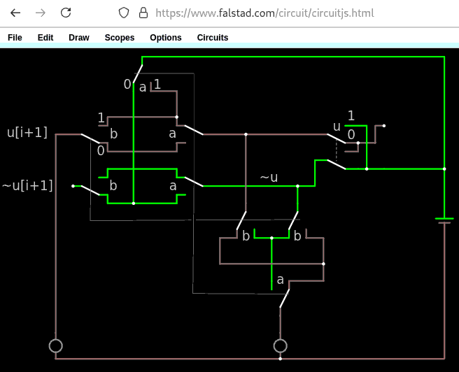
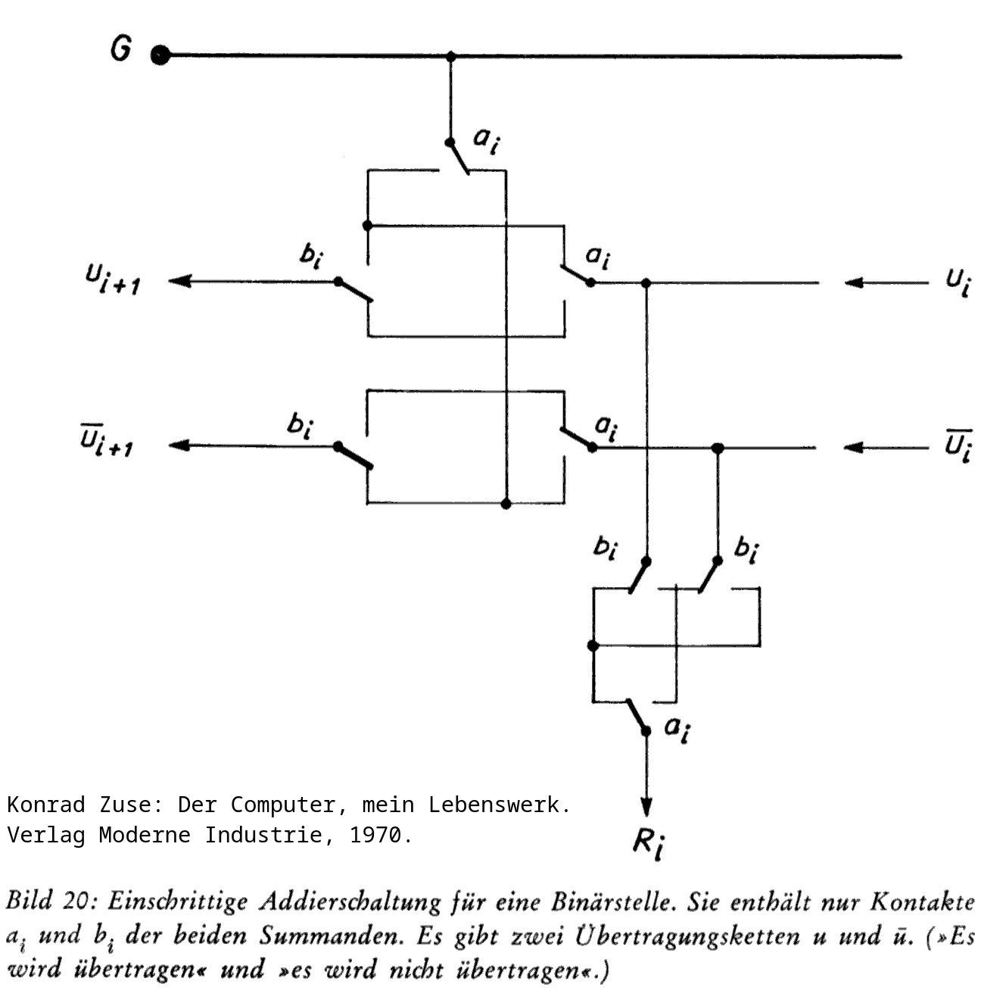
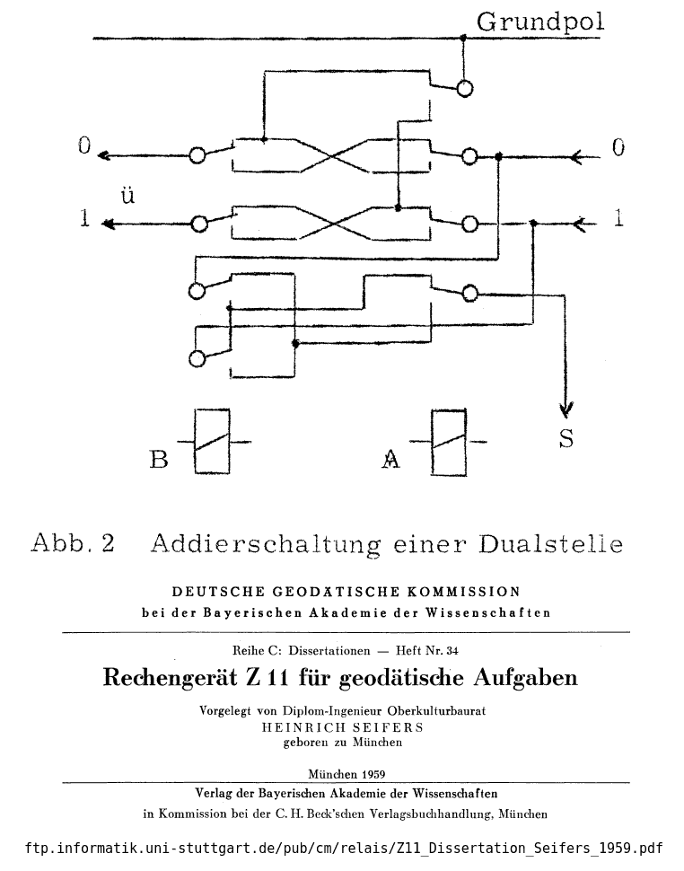

# Konrad Zuse's Single Step Adder
A full binary adder using nothing but 4PDT, as described by Heinrich Seifers [ˈhaɪ̯nʁɪç ˈzaɪ̯fɐs] and Konrad Zuse [ˈkɔnʁat ˈtsuːzə]

This is a full binary adder, as described in Konrad Zuse: *Der Computer, mein Lebenswerk*. Verlag Moderne Industrie, 1970, and Heinrich Seifers: *Rechengerät Z11 für geodätische Aufgaben*. Verlag der Bayerischen Akademie der Wissenschaften, 1959. The trick is to have not only the carry bit `u` itself, but also its inversion available. This way, a 4PDT switch (relais) per summand's bit (`a`, `b`) is enough to build the sum bit and also the carry bit `u[i+1]` towards the next adder further left.

To subtract, flip subtrahend's bits ("one's complement") and set initial (rightmost) carry to one. This is called "two's complement". The result, possibly negative, is then two's complement encoded, too.

Konrad Zuse mentions Aiken and Stibitz from the USA, too. He calls this circuit a single step adder, because prior to that he built three-step adder (which consumed the summands in the 1st step, calculated the carry in the 2nd step, and calculated the result in the 3rd step).
